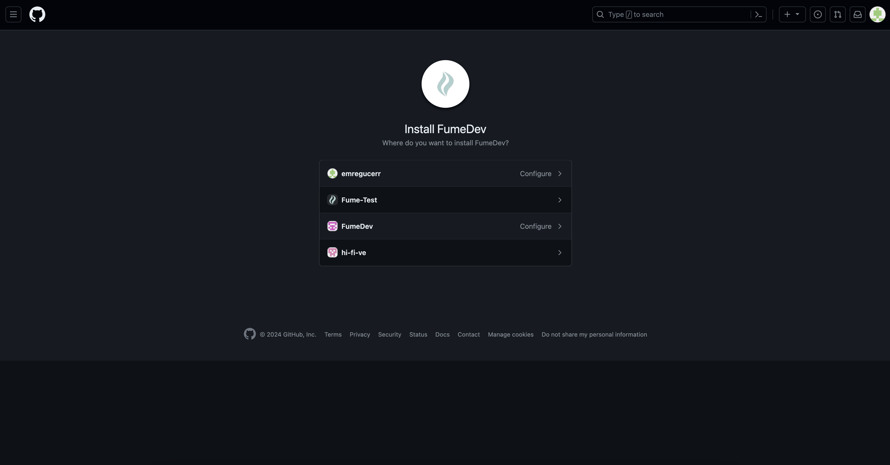

## Setup the Github App

You need to set up the Fume Github App. This will let Fume to make changes in your codebase and submit PRs. Use the following link to install it on your workspace.
<Card
  title="Install Fume Github App"
  icon="github"
  href="https://github.com/apps/fumedev/installations/select_target"
>
  A friendly AI sfotware engineer for your code chores
</Card>

Rest is very straightforward: Simply select the the organization and repository you want to give Fume access to. Then, you are done!

### Security

Fume never permanently stores your code. All of your code is deleted from our servers are deleted after the runtime.