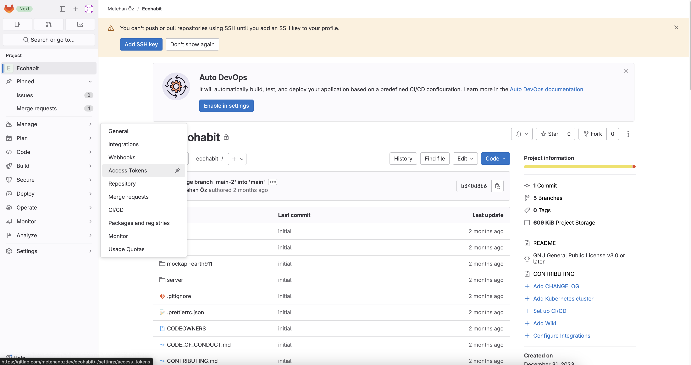

## Create a Bot Token

The first thing you have to do to setup your GitLab repository for Fume is creating a bot token. You can do so by navigating to your repository page. Then you will have to follow to following Settings > Access Tokens tabs. The tabs can be found in the bottom left opf your window.

Then, click on the `Add new token` button located at the topn right corner of the tokens table. Follow the steps below to correctly set up your acess token.

#### 1) Set the token name as `fume[bot]`
#### 2) Set the token role `developer`
#### 3) Grant the following scopes: `api`, `read_api`, `read_repository`, `write_repository`
#### 4) Finally, click on the `Create project access token` button

Now, your token must be created. Save the token somewhere, because you will need it for the next step while setting up the Slack app.

