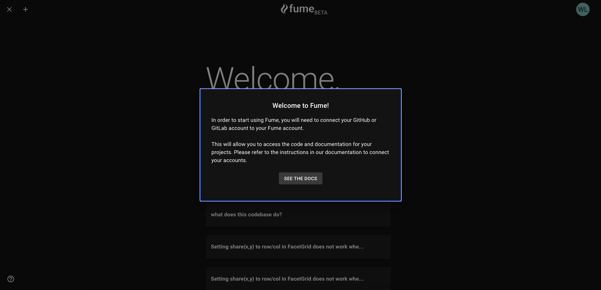
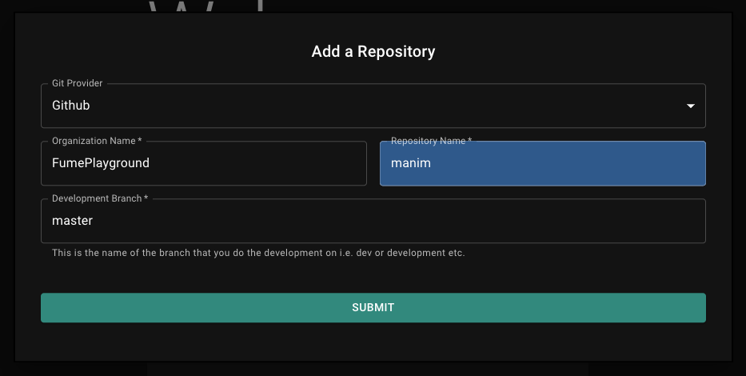
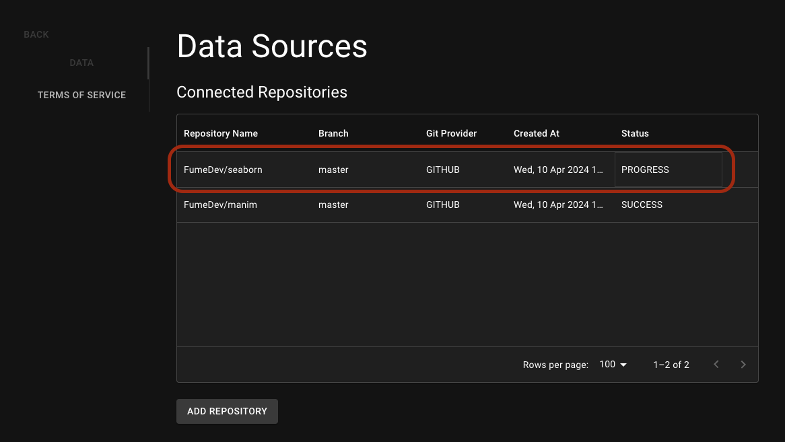

## Setting up

The first thing you have to do is signing up for an account <a href="https://app.fumedev.com/signup"> here </a>

Signing up will give you a 14-day free trial period without requiring any payment information. During the free trial period, you can use Fume to its fullest. If you choose not to continue your subscription after 14 days, you do not need to take any further action. Your subscription will be automatically canceled after the 14 day trial period.

## Connect Your Code Repositories

Will need to access your codebases in order to function properly. We do not permanently store any of piece of your codebase and your data is not used for the training of the models we use.

In order to connect your codebases, you will need go through necessary setup steps depending on your git provider. Fume currently supports Github and GitLab. Our BitBucket integration is coming soon...

<Card
    title="Github Integration"
    icon="github"
    href="/github"
  >
</Card>
<Card
    title="GitLab Integration"
    icon="gitlab"
    href="gitlab"
>
</Card>

## Signing In Your Account for the First Time
When you first sing in your accountm, you will be prompted to visit the documentation to learn how to set up your git provider with Fume. If you have already completed this step, you can dismiss the popup bu clicking anywhere else on the screen.

You will be prompted with an empty chat history and unable to start any tasks. The reason for this is that you did not add any repositories to Fume yet! Next section will guide you through the process of adding your first repository.

## Adding Your First Repository

To add you first repository, click on the 'Add Repo' button in the Home page - marked with red in the image below.

You will be prompted with a form to enter the relevant information for your repository. You will need to provide the following information:

- Git Provider (Github or Gitlab)
- Org Name
- Repo Name
- Development Branch Name

Once you have filled in the form, click on the 'Submit' button to add your repository to Fume.

If you are using Github, you will be prompted to enter a personal access token. This token will allow Fume to verify that you really have access to the repository you want to add. You can create a personal access token in your Github settings. The popup screen will include the relevant link and the necessary permission names to do that. When you create one, simply copy and paste the token to the relevant field.

On the other hand, if you are using Gitlab, you will be prompted to enter your Gitlab token and Gitlab URL. This is the token you generated previously in the section <a href="/gitlab">Gitlab Integration</a>. Copy and paste the token you saved from the previous section to the relevant field.

_Team's Note: Some users are reporting a bug where they have to re-enter their repo information after entering the Github access token. If you exeperinece the same issue, we apologize for the inconvinience. Kindly, re-enter the info and all should be good._

After adding a repository, it might take a few seconds for Fume to verify all of the information you just entered. Wait until the spinner disappears and you get redirected to the 'Settings' page.

In the 'Settings' page, you will be able to see the name of the repository you just added. The status for the newly added repository should be 'PROGRESS'. This means that Fume has started processing your codebase.

This processing can take a while. Anywhere between 10 minutes to a few hours depending on the size of your codebase. If, anything goes wrong, the status will change to 'FAILIURE'. In that case, please contact us at contact@fumedev.com. Also, Fume's processing should not take more than 6 hours (if you are not uploading the Linux kernel). If it takes longer than that, please contact us from the same email.

When the status of your repository changes to 'SUCCESS', you can now start using Fume! Go back to your 'Home' page and start your first task and select the repository you just added.

## Slack Integration for Your Team (Optional)

If you are using Slack for your team communication, you can connect Fume to your Slack workspace! Everday engineers ask each other many technical questions and they lose time for both answering and searching for the answer. Fume can act as the experienced engineer who understands ever part of your codebase(s). To connect Fume to your Slack workspace and save valuable hours for your team, see the guide below.

<Card
    title="Slack Integration"
    icon="slack"
    href="/slack"
  >
</Card>

## Use Cases

Update your docs to your brand and add valuable content for the best user conversion.

<CardGroup cols={2}>
  <Card
    title="UI & Copy Changes"
    icon="palette"
  >
    Submit a task alongside a screenshot, and Fume will implement the necessary UI changes in your product.
  </Card>
  <Card
    title="Bugs"
    icon="bug"
  >
    Fume is especially good at debugging your product. Give it the steps to reproduce the bug and a possible solution, Fume will debug the issue.
  </Card>
  <Card
    title="Error Logs"
    icon="screwdriver-wrench"
  >
    Connect your Sentry or Datadog logs to a Slack channel and Fume will generate solutions immediately.
  </Card>
  <Card
    title="New Features"
    icon="stars"
  >
    You'd be surprised how much can Fume achieve in your codebase. It's doesn't always get fullout features right but it sets a very strong foundation for your team to pick up.
  </Card>
</CardGroup>
