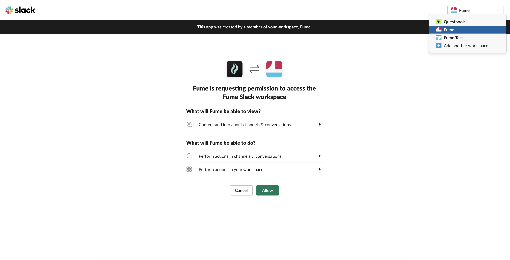
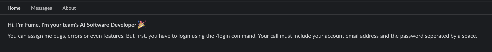

## Setup the Slack App

You need to set up the Fume Slack App. This will let you assign tasks to Fume with image and text descriptions. Use the following link to install it on your workspace.
<Card
  title="Install Fume Slack App"
  icon="slack"
  href="https://slack.fumedev.com/slack/install"
>
  A friendly AI sfotware engineer for your code chores
</Card>

Click on the `Add To Slack` button. Before enabling Fume in your workspace, make sure you are setting it up for the correct workspace.

A successful installation will redirect you to Fume's Home page. If you the welcome message below. navigate to the `Messages` tab.

### Logging In With Slack

As you naviage to the `Messages` tab, you will be able to type messages and slash commands for Fume app. The first thing you must do is logging in. For that, type in the following command.

`/fume-login {your_email} {your_password}`

Note that the curly brackets are only for placeholders. Your command call must be your email and password with a single space in between.

If the login attempt is successful, you will be prompted with a success message like the one below.

After you have completed all of these steps succesfully, you should be done with setting Fume for your Slack workspace! Go to one of you *PUBLIC CHANNELS* and ask a question with Fume tagged in the end. Everything after that is the same flow that you know and love with the web app. 

Note that Fume, for now, only supports Slack public channels. If you want to use Fume in a private channel or a DM, you will have to contact us at contact@fumedev.com.

