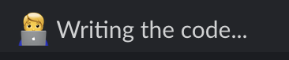

## Assigning a Task

In this section, we will go through an example task Fume has previously completed to show you how you can assign tasks to Fume and generate PRs with just a single prompt!

Here is a real issue from Supabase's public repository `supabase/supabase-js`. The issue involves a textual explanation of a bug and a set of screenshots. The first thing to do is mentioning @Fume in our rpely to this report. For the sake of example, we will only tell Fume to 'solve it'. This is due to two reasons: the is relativly a simple one and I don't really know anything about this repo, so I don't have anything to suggest :) However, you should offer a potential solution and show direction as much as you can for optimal performance.

When Fume picks up your task, it will react to your message with the :eyes: emoji. This means Fume has started to solve this problem and will come back to you with the relevant files it found in the codebase.

The files are given as a list of checkboxes. First thing you should is deselcting the ones that are obviously irrelevant to the task. You should keep the files that require changes or contain useful context. Then, if there are any files that you think is necessary for solving this task, you can type in a phrase or filepath you want to search in the codebase. Simply type the phrase in the same thread *without* tagging @Fume. If you want to search multiple phrases at once, seperate them by commas.

When you are done adding and removing files, simply click the last `Done` button. Doing so will allow Fume to start planning what to do.

When Fume is done with its plan, it will ask you if the plan looks good or not. You can indicate your answer using the `Yes` and `No` buttons after the plan message. If your answer is no, simply descirb your feedback buy messaging in the same thread without tagging @Fume. Fume, will start modifying its plan according to your plan.

When you are finally content with the plan Fume came up with, simply click on the `Yes` button and Fume will start coding.

Within a couple of minutes your PR will be submitted in your repository, ready for your review!

## Helpful Context For Fume to Perform Better

### Location of the problem/solution

If you have a large codebase, giving a name for code component (lika a variable or function name) or a file path (event not 100% accurate) is very halpful for Fume to have a starting point.

### Suggesting a Potential solution

Most of the time, an engineer has an initial plan of attack for the tasks. Giving what you have on your mind as context for Fume substantially increases the code planning quality for Fume.

### Be Specific

Taking the guesswork out of any task is very helpful. For example, if you want a button top be added on a screen, specifically describing where it should be located at will positively impact the odds of Fume putting out an accurate work.

### Give feedback

Maybe the most helpful thing you can do is providing feedback. LLMs improve drastically with feedback and Fume will have much higerh merge rate if you provide useful feedback on its plans.